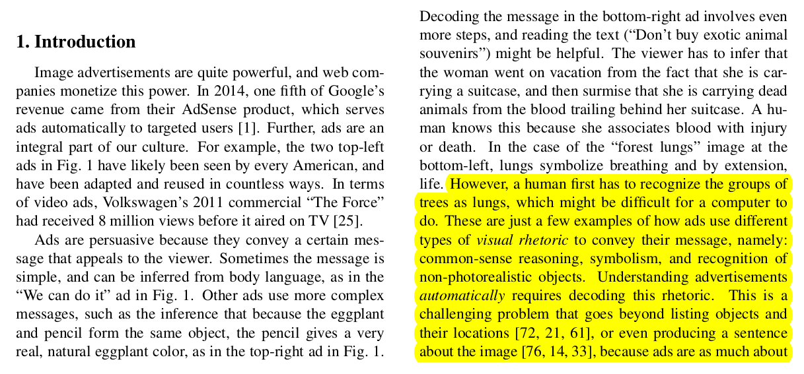
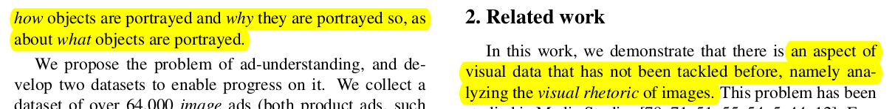
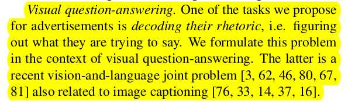

# Ad Creative Recognition With Computer Vision

## Table Of Contents:
* [Visual Rhetoric In Ad Creative](#visual-rhetoric-in-ad-creative)
* [Using CNNs](#using-cnns)
* [Using CLIP](#using-clip)
* [Explaining Visual Features of Ad](#explaining-visual-features-of-ad-creative)

## Results

| Model Name         | Train Accuracy | Validation Accuracy |
|--------------------|----------------|---------------------|
| ResNet152          | 79.28          | 79.96               |
| CLIP(Original Weights) | --             | 90.2                |
| CLIP(Finetuned)    | 98             | 94.6                |

## Visual Rhetoric In Ad Creative

Ads are persuasive because they convey a certain message that appeals to the viewer. These are just a few examples of how ads use different types of **visual rhetoric** to convey their message, namely:

- Common-sense reasoning,
- Symbolism, and
- Recognition of non-photorealistic objects.

## Using CNNs

We need to develop a method to decode symbolism in ads to better understand the visual rhetoric in an Ad Creative.

### CNNs to Decode the Visual Rhetoric in an Ad Creative

Checkout the [notebook](ImageUnderstanding.ipynb) for CNN-based solutions.

| Model Name | Train Accuracy | Validation Accuracy |
|------------|----------------|---------------------|
| ResNet152  | 79.28          | 79.96               |

## Visual Question Answering

## Using CLIP

### Using ViT(Vision Transformers) based CLIP model

Check out [CLIP Finetuning](Adv_CLIP/Adv_CLIP_Custom.ipynb)

#### Using Pretrained

| Model Name         | Train Accuracy | Validation Accuracy |
|--------------------|----------------|---------------------|
| CLIP(Original Weights) | --             | 90.2                |

As seen above, although the accuracy of CLIP is high, it also has a high False Positive Rate (FPR) due to being trained on very large general data.

### The FPR can be significantly reduced to around 0.1 to 0.04 by fully training the CLIP model and increasing the dataset size.

**Note:** CLIP can't be easily trained on small systems and requires substantial time and computational resources.

#### Finetuned CLIP

| Model Name     | Train Accuracy | Validation Accuracy |
|----------------|----------------|---------------------|
| CLIP(Finetuned)| 98             | 94.6                |

#### FPR(False Positive Rate) = 0.41

## Explaining Visual Features of Ad Creative

To explain the visual rhetoric of the image, we merge our model CLIP with an LLM using a projection matrix. To do so, I used an already available model named LLaVA.

### Also, to finetune LLaVA for Ad Creative Visual Explanation, I created a custom **Visual Instruction Tuning** dataset and further finetuned the model.

## Example Explanation of an Ad Creative by LLaVA

